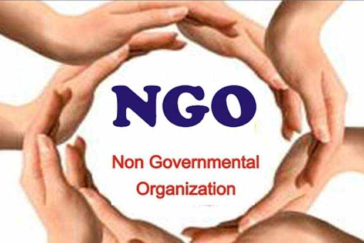

# Linky :heart: *For helping people*
As the name suggest **Linky** is an app which `connects` or links two or more people or organisation. :family:

## But what is the purpose of linking?
It links the `NGO`, to different people who want help for themselves or others.
1.   
2. 
3.  

## Working steps:
1. People request the help they need for themselves or some other poor people from NGO.
2. NGO's contact the person to provide help by the means of app.
3. This way app links the 'needy and poor people'  with the 'NGO' by the means of other peoples in between. 

## Tools and Technologies used
1. Programming language-`JAVA`
2. Data base-`Firebase`
3. IDE- `Android studio`

### Contributors
1. `Rahul Kesharwani` (rahulkesharwani353@gmail.com)
2. `Dheeraj Ghosh`(dheerajghosh007@gmail.com)
